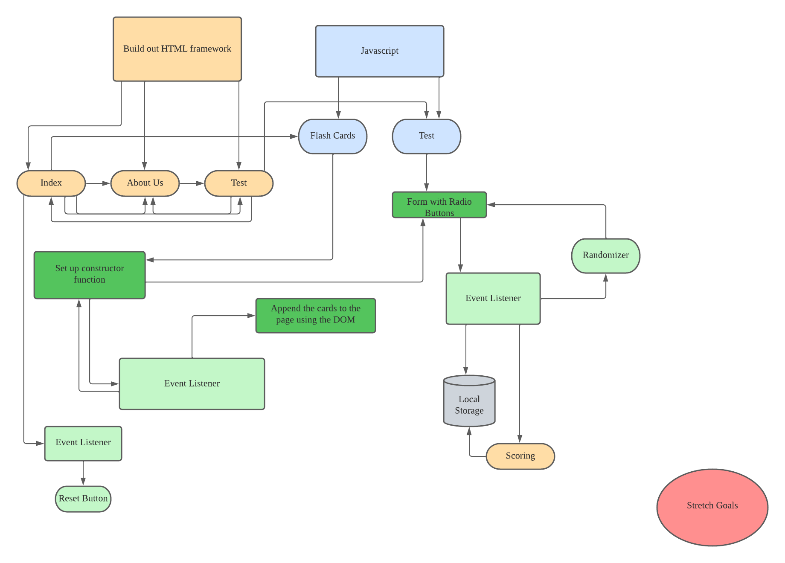
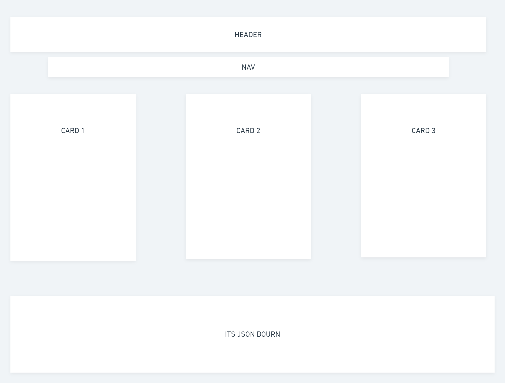
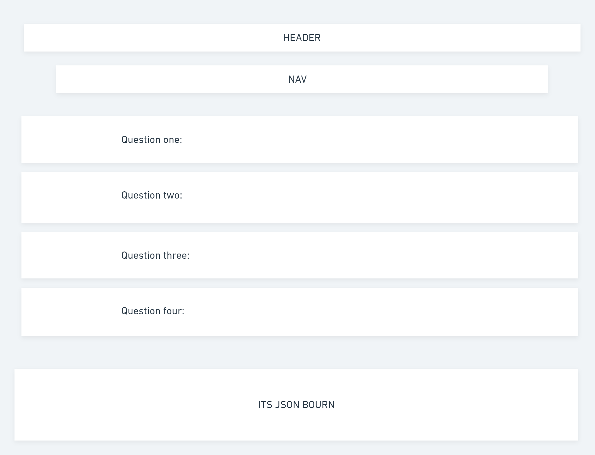
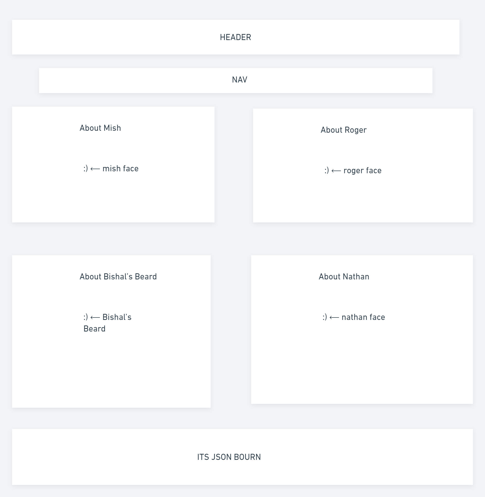

# terminal-development

This is a group project to create a flashcard terminology game for 201 students.

## Cooperation Plan

Strengths: Nathan backend, Roger styling and design, Bishal jscript, Michelle front end & organization.

We will allow the team members who are more comfortable with back end pair program with front end team members so that we can all learn from each other and have a strong partner in areas where we feel we need more practice in. Our day to day work will be to meet every morning and talk about what our MVP is for the day and discuss how we plan to accomplish this.

## Conflict Plan

Take a vote
Tie breaker instructor/TA
Be reasonable, and supportive.
Pair program in pairs where one person who is strong and the other who maybe needs more practice work together and vice versa
try to be accountable, and speak up during our meets about how we feel everyone is doing.
reach out to instructor as a team to discuss how to resolve and move forward positively

## Communication Plan

Hours:
Nathan: Class time 9-6
Roger: Class time 9-6 (16hours ahead)
Bishal: Class time 9-6
Mish: Class time 9-6, Tues 12:30-1:30pm apt
communication will happen via Slack
Breaks- every hour or as needed
Assess what we need, what is viable, potentially scale back our features.
NO weekend work needed or wanted. Will communicate via slack.
Transparency, let people know when you feel like you’re not being heard. Acknowledging when someone speaks up.

## Work Plan

Establishing clear and concise goals
“this feature does these things”
establishing daily or hourly goals for MVP for that day/hour. Small tasks or features.
PM Management tool will be github projects

## Git Process

All component’s will be on Github
Creating a organization where everyone is contributor
We will pair program and we will create branches by feature/team and acp hourly to avoid loss
PR review will be done by 2 members of the non-submitting team.
merging will be done at end of day or at end of milestone features.
We will use slack to communicate if working separately to merge as a team.

## DAY 1

## Software requirements

What is the vision of this product?
We are trying to provide a product that helps 201 students learn technical terminology and be able to recognize code block and their terminology by sight.

What pain point does this project solve?
This project will eliminate the difficulty of memorizing correct coding terminology as well as facilitate good communication between developers.
Why should we care about your product?
Our product will be able to help students effectively learn coding terminology,

## Scope (In/Out)

Our product will present the user with a flash card view with technical terms and their definitions and also multiple choice questions with an optional 3 possible answers. The user will be able to choose either quiz or flashcards at anytime while they are visiting our site. The user will be asked for their name at the start of the page so they can be greeted by our game.
The flashcard view will allow the user to view up to 3 cards at a time.
Once one is selected the card will turn over, technical terms definition will be displayed.

The user can review all three cards in that shuffle.
The test view will give the user a question or scenario and provide up to 3 answers per question.

The answers may sound or look similar.

when the correct is picked it will display a definition of that term.
At the end of the test the user will be able to display their score for the test.

Our product will not allow you add more terms. It will not allow you to change any information that already been programmed. You will also not be able to share your results.

As a __, I want__, so that ___

1. As a user I want to be able to access I want to be able to take a quiz at anytime during my visit. So that If I feel that I do not want to use flashcards I can test my knowledge right away.
   - The team will create a link or button that the user can click at any time and it will take them to the test page.
   - This will be done by creating a second HTML page named quiz.html and will be loaded once the button is clicked.
2. As a user I want to be able to reset the flashcards at once I am done with my first round of views.
   - The team will need to create a event handler that will recognize the click on the reset button and refresh the home page.
   - The event handler will need to be listen for clicks of the HTML element so that it knows when to reset.

3. As a user I want more than one option for answers when taking the quiz displayed to me so I can learn about more than one term at a time.
   - A form will be created with multiple options for each question and will be triggered by a selection of a radio button and the correct answer.
   - The team will need to create an event handler that recognizes the selection of the incorrect and correct answer.
4. As a user I want to know more about the developers and why they decided to create this page.
   - An about us page will be created with pictures and bios for each team member and a vision summary for this project.
   - The about us page will be available as a link in all pages the user has access to.

5. As a user I want to be able to clearly understand how to navigate the page.
   - The team will need to create clear links to internal pages with minimal styling.
   - A Nav bar will be created with up to 3 links home page, about us page, and quiz page on all pages.

## Minimum Viable Product

What will your MVP functionality be?
To get both the flashcard and test pages up and running. Allow the user atleast 3 rounds of flashcard view so 15 cards total. The test page will allow the user to have at least 10 questions with atleast 2 possible answers and definitions behind the answers.

What are your stretch goals?
Keeping score with local storage
The ability to use prompts to get the users name and incorporate the users name in the game and quiz.

## Domain Modeling

## Wireframe

## SourceLinks

Presentation Deck
<https://docs.google.com/presentation/d/1v3GfjlqDmR7e8PjacVSs1sZgEwq8PGbS91dbc77y9mE/edit#slide=id.g2accd1c413_1_44>

Color palettes:
<https://coolors.co/palette/003049-d62828-f77f00-fcbf49-eae2b7>

<https://coolors.co/palette/335c67-fff3b0-e09f3e-9e2a2b-540b0e>

<https://coolors.co/palette/f94144-f3722c-f8961e-f9844a-f9c74f-90be6d-43aa8b-4d908e-577590-277da1>

<https://coolors.co/palette/001427-708d81-f4d58d-bf0603-8d0801>

CSS transitions and animations
<https://learn.shayhowe.com/advanced-html-css/transitions-animations/>
Border Radius for Flashcard Size
<https://developer.mozilla.org/en-US/docs/Web/CSS/border-radius>

FlipCard tutorial W3 schools:
<https://www.w3schools.com/howto/howto_css_flip_card.asp>

Button Animation
<https://learn.shayhowe.com/advanced-html-css/transitions-animations/>
